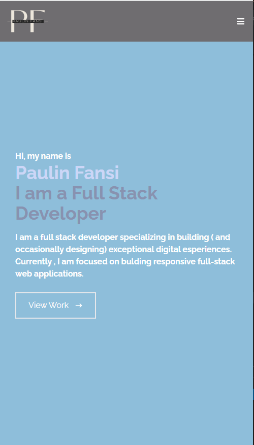

# react-portfolio-app

## Table of Contents:

- [Git-Repository](#git-repository)
- [Github-Pages-deployment](#application-deployment)
- [Description](#description)
- [Technologies-Used](Technologies-Used)
- [License](#license)
- [Questions](#questions)

## Git Repository

I created a git repository folder that will host the finished project. The Repository will be found [here](https://github.com/pfansi/react-portfolio-app).

## Application Deployment

The React portfolio has been deployed to Github pages. Please click on the following link to view the application. [click here]( https://pfansi.github.io/react-portfolio-app/).

## Description:

Being a web developer means being part of a community. I will be building a portfolio website with React.js that will share my portfolio of works or projects. This platform is aiming to showcase myself while applying for jobs or looking for freelancing work. The shared projects on the platform will also be open for contributions and collaboration with other developers.
Using my react skill in building this portfolio website will help to set apart other developers whose portfolios don’t use the latest technologies.
The application will be styled using the framework Tailwing Css for React application.
`md npm install -D tailwindcss postcss autoprefixer `
The application will be deployed to GitHub Pages.

## Technologies Used

- Node.js
- React
- Javascript
- Css
- HTML
- Tailwind Css
- Webpack

## Screenshot of the Homepage or landing page

- 
- 

## License:

[License: MIT](https://opensource.org/licenses/MIT)

# This Project is licensed under the MIT license

## Questions:

- **Contact details:**
  - Github: [@pfansi](https://github.com/pfansi)
  - Email: pfansi76@gmail.com
